# Architecture

## Layered Design: 4 Concentric Rings

QUANTAF follows a **4-layer concentric architecture** that separates concerns and enables extensibility at every level.

```mermaid
graph TB
    A["🧪 Layer 4: Test Definition<br/>TestNG, Cucumber, Scenarios"] -->|Uses| B["🤖 Layer 3: AI Cortex<br/>LLM, NLP, Scenario Generation"]
    B -->|Uses| C["⚙️ Layer 2: Logic Core<br/>MarketMaker, TradeLedger, Domain Logic"]
    C -->|Uses| D["🌐 Layer 1: Protocol Adapters<br/>FIX, SWIFT, MQ, REST"]
    D -->|Communicates with| E["🏦 Financial Systems<br/>Trading, Settlement, Reconciliation"]
```



### Layer 1: Protocol Adapters 🌐

The foundation layer responsible for translating QUANTAF commands into financial protocol messages and handling protocol-specific concerns.

**Responsibilities:**
- Serialize/deserialize messages (FIX, SWIFT, MQ, REST)
- Manage protocol-specific sessions and connections
- Stub registry for mocking financial services
- Handle message validation and error states

**Key Components:**
- **FIX Adapter**: Full support for FIX 4.2, 4.4, and 5.0 using QuickFIX/J
- **SWIFT Adapter**: Message handling and validation for SWIFT standard
- **MQ Adapter**: Message broker abstraction (pluggable for RabbitMQ, ActiveMQ, etc.)
- **REST Adapter**: OAuth2-aware HTTP client with request/response logging

### Layer 2: Logic Core ⚙️

Business logic layer that implements financial domain concepts and trading operations.

**Responsibilities:**
- Trade lifecycle management
- Reconciliation and settlement logic
- Statistical data generation
- Domain model validation

**Key Components:**
- **MarketMaker**: Statistical distribution engine for realistic data generation (normal, exponential, Poisson)
- **TradeLedger**: Immutable ledger tracking trades through their lifecycle
- **Domain Models**: Trade, Order, Settlement, Party, Instrument classes
- **Business Rules**: Validation rules for financial constraints

### Layer 3: AI Cortex 🤖

Intelligent scenario generation and NLP processing layer powered by LangChain4j.

**Responsibilities:**
- Convert natural language to FIX messages
- Generate realistic trading scenarios
- Create smart SWIFT stubs
- Pluggable LLM integration

**Key Components:**
- **FixScenarioAgent**: Converts English descriptions to FIX message sequences
- **SmartStubGenerator**: Creates realistic SWIFT message responses
- **LLM Providers**: OpenAI, Ollama, or custom provider support
- **Scenario Translator**: Maps business requirements to protocol-specific messages

### Layer 4: Test Definition 🧪

Top layer providing test harnesses and scenario definitions.

**Responsibilities:**
- Define test cases and scenarios
- Execute tests with TestNG or Cucumber
- Collect and report results
- Manage test lifecycle

**Key Components:**
- **TestNG Runner**: Direct Java test execution with assertions
- **Cucumber Runner**: BDD-style feature files with step definitions
- **Allure Integration**: Rich reporting and analytics
- **Assertion Library**: Financial-domain-aware assertions

## Data Flow Example

```
User: "Test a trade settlement"
     ↓ (Layer 4: Test Definition)
TestNG/Cucumber parses scenario
     ↓ (Layer 3: AI Cortex)
FixScenarioAgent converts to FIX messages:
  → D93 (New Order - Single)
  → 8=FIX.4.4 | 35=D | 11=ORDER123 | ...
     ↓ (Layer 2: Logic Core)
MarketMaker generates realistic prices
TradeLedger records trade state
     ↓ (Layer 1: Protocol Adapters)
FIX Adapter sends message to exchange
REST Adapter polls settlement status
MQ Adapter receives settlement confirmation
     ↓ (Back through layers for validation)
Allure Reports test results
```

## Extension Points

Extend QUANTAF by implementing interfaces at any layer:

- **Custom Protocol**: Implement `ProtocolAdapter` in Layer 1
- **Business Logic**: Extend `TradeLedger` or `MarketMaker` in Layer 2
- **AI Features**: Implement `ScenarioAgent` in Layer 3
- **Test Runners**: Create custom runners in Layer 4

## Separation of Concerns

| Layer | Concern | Testable | Extensible |
|-------|---------|----------|------------|
| 1 | Protocol handling | ✓ | ✓ |
| 2 | Business logic | ✓ | ✓ |
| 3 | AI/ML features | ✓ | ✓ |
| 4 | Test execution | ✓ | ✓ |

This architecture ensures that changes to one layer don't affect others, making the framework robust and maintainable.
