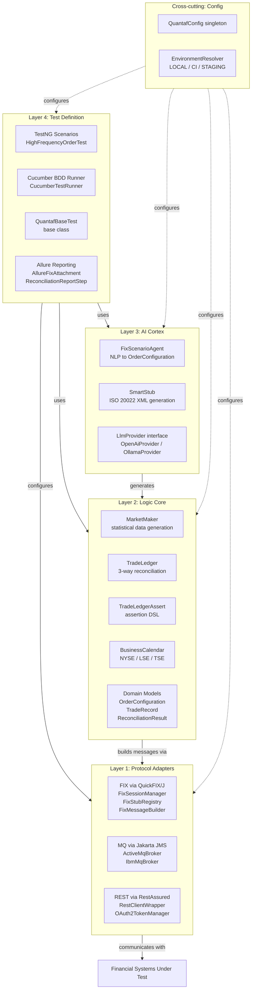

# Architecture

## Layered Design: 4 Concentric Rings

QUANTAF follows a **4-layer concentric architecture** that separates concerns and enables extensibility at every level.



---

### Layer 1: Protocol Adapters 🌐

The foundation layer responsible for translating QUANTAF commands into financial protocol messages and handling protocol-specific concerns.

**Responsibilities:**

- Serialize / deserialize messages (FIX, MQ, REST)
- Manage protocol-specific sessions and connections
- Stub registry for mocking exchange responses
- Handle message validation and error states

**Key Components (actual classes):**

| Class | Package | Purpose |
|-------|---------|---------|
| `FixSessionManager` | `protocol.fix` | Manages multiple FIX sessions across versions (FIX 4.2, 4.4, 5.0). Starts/stops `SocketInitiator` and `SocketAcceptor` instances via QuickFIX/J. |
| `FixInitiatorWrapper` | `protocol.fix` | Client-side FIX Application that sends orders and correlates responses by ClOrdID using `CompletableFuture`. |
| `FixAcceptorWrapper` | `protocol.fix` | Server-side FIX Application (exchange stub) that routes incoming messages through `FixInterceptor`. |
| `FixInterceptor` | `protocol.fix` | Evaluates incoming FIX messages against the `FixStubRegistry` and auto-generates responses (a WireMock-like mechanism for FIX). |
| `FixStubRegistry` | `protocol.fix` | Thread-safe registry of predicate → response mappings. Supports sequential responses, configurable delays, call counting, and descriptive naming. |
| `FixMessageBuilder` | `protocol.fix` | Fluent builder for constructing FIX messages (NewOrderSingle `35=D`, ExecutionReport `35=8`, OrderCancelRequest `35=F`). Also provides convenience methods `fromOrderConfig()`, `rejectionFor()`, and `fillFor()`. |
| `FixVersion` | `protocol.fix` | Enum defining supported FIX versions (`FIX42`, `FIX44`, `FIX50`) with their BeginString, config file path, and data dictionary reference. |
| `ActiveMqBroker` | `protocol.mq` | ActiveMQ Artemis implementation of `MessageBroker` using Jakarta JMS. Supports `publish()`, `listen()`, and `listenWithFilter()` with timeout-based polling. |
| `IbmMqBroker` | `protocol.mq` | Skeleton IBM MQ implementation of `MessageBroker` (ready for IBM MQ client libraries). |
| `MessageBroker` | `protocol.mq` | Pluggable interface for message broker interactions. Defines `publish()`, `listen()`, `listenWithFilter()`, `isConnected()`, and `close()`. |
| `RestClientWrapper` | `protocol.rest` | RestAssured wrapper with built-in OAuth2 support. Provides `get()`, `post()`, `put()`, `delete()` methods. |
| `OAuth2TokenManager` | `protocol.rest` | Manages OAuth2 token lifecycle — acquires, caches, and auto-refreshes access tokens before expiry (with a 60-second buffer). |
| `PortfolioApiClient` | `protocol.rest` | Typed REST client for portfolio operations (position lookup, trade settlement status) that delegates to `RestClientWrapper`. |

:::info[FIX Session Architecture]
Each FIX version has its own QuickFIX/J configuration file (`quickfix-FIX42.cfg`, `quickfix-FIX44.cfg`, `quickfix-FIX50.cfg`) located in `src/main/resources/`. Each config defines both an **initiator** session (trader side — SenderCompID `QUANTAF_CLIENT`, connects to the system under test on port `9876`) and an **acceptor** session (exchange stub side — SenderCompID `QUANTAF_EXCHANGE`, listens on port `9877`). The FIX version for FIX 5.0 uses `FIXT.1.1` as its BeginString.
:::

---

### Layer 2: Logic Core ⚙️

Business logic layer that implements financial domain concepts, realistic data generation, and cross-source reconciliation.

**Responsibilities:**

- Generate realistic financial test data using statistical distributions
- Cross-source reconciliation of trade records (FIX, MQ, API)
- Settlement date calculations with business calendar support
- Domain model for orders and trade records

**Key Components (actual classes):**

| Class | Package | Purpose |
|-------|---------|---------|
| `MarketMaker` | `core` | Statistical distribution engine that generates realistic prices (Normal/Gaussian), volumes (Poisson), correlated price series (Cholesky decomposition), settlement dates (T+N with business calendar), trade timestamps (market hours 9:30–16:00 ET), ClOrdIDs, and account identifiers. All methods are thread-safe. |
| `TradeLedger` | `core` | Cross-source reconciliation engine. Accepts `TradeRecord` objects from FIX, MQ, and API sources, normalizes them, and performs field-by-field comparison (price, quantity, amount, settlement date, symbol, currency, account) within configurable tolerance. |
| `TradeLedgerAssert` | `core` | Custom assertion DSL for reconciliation results. Supports `assertParity()`, `assertAmountMatch(tolerance)`, `assertSettlementDateMatch()`, and `assertFieldMatch(fieldName)` with fluent chaining and descriptive failure messages. |
| `BusinessCalendar` | `core` | Business calendar supporting weekends and configurable holidays (specific dates and recurring MonthDay patterns). Includes factory methods for NYSE, LSE, and TSE calendars. Provides `addBusinessDays()`, `businessDaysBetween()`, and `isBusinessDay()`. |
| `OrderConfiguration` | `core.model` | Structured order configuration with fluent builder pattern. Contains enums for `Side` (BUY, SELL, SHORT_SELL), `OrderType` (MARKET, LIMIT, STOP, STOP_LIMIT), `TimeInForce` (DAY, GTC, IOC, FOK, GTD, AT_CLOSE), and `ExecType` (NEW, PARTIAL_FILL, FILL, CANCELED, REPLACED, PENDING_CANCEL, REJECTED) — each with their FIX tag char values. |
| `TradeRecord` | `core.model` | Normalized trade record from any source. Uses a fluent builder with factory methods `fromFix()`, `fromMq()`, `fromApi()`. Tracks orderId, clOrdId, symbol, quantity, price, amount, currency, settlementDate, executionTime, account, execType, and arbitrary additional fields. Correlation key is ClOrdID (fallback to OrderID). |
| `ReconciliationResult` | `core.model` | Structured reconciliation output containing field-level `FieldComparison` records (Java record) for each compared field. Each comparison stores fixValue, mqValue, apiValue, and match status. Includes `toDetailedReport()` for formatted tabular output. |

:::note[Reconciliation Model]
The TradeLedger maintains **three separate maps** (one per source: FIX, MQ, API) keyed by correlation key. Reconciliation compares numeric fields within a configurable tolerance (default: `0.0001` with 8-digit precision) and performs exact matching for strings and dates. This three-way comparison model ensures that data arriving through different protocols is consistent.
:::

---

### Layer 3: AI Cortex 🤖

Intelligent scenario generation and NLP processing layer powered by LangChain4j.

**Responsibilities:**

- Convert natural language descriptions to structured `OrderConfiguration` objects
- Generate ISO 20022 (SWIFT) XML messages from intent descriptions
- Provide pluggable LLM integration with template fallback for deterministic CI runs
- Cache AI responses for reproducibility

**Key Components (actual classes):**

| Class | Package | Purpose |
|-------|---------|---------|
| `FixScenarioAgent` | `ai` | NLP-to-FIX translation agent. Operates in two modes: **LLM mode** (uses a pluggable `LlmProvider` with a structured system prompt to produce JSON) and **Template mode** (keyword-based deterministic generation for CI). Extracts symbol, side, order type, time-in-force, quantity, and price from natural language using regex patterns against a known symbol dictionary (AAPL, GOOG, MSFT, TSLA, AMZN). |
| `SmartStub` | `ai` | AI-driven generation of ISO 20022 (SWIFT) XML messages. Supports LLM-based generation with a SWIFT-specific system prompt and template fallback for `pacs.008` (Credit Transfer), `camt.053` (Bank Statement), and `sese.023` (Securities Settlement). Includes response caching for deterministic replay. |
| `LlmProvider` | `ai` | Interface for pluggable LLM backends. Defines `complete(systemPrompt, userMessage)`, `getProviderName()`, `getModelName()`, and `isAvailable()`. |
| `OpenAiProvider` | `ai.providers` | OpenAI implementation using `langchain4j-open-ai`. Builds a `ChatLanguageModel` with configurable API key, model name, and temperature (default: 0.1 for deterministic output). |
| `OllamaProvider` | `ai.providers` | Ollama (local LLM) implementation using `langchain4j-ollama`. Connects to a local Ollama server (default: `http://localhost:11434`) with configurable model name and temperature. |

:::tip[AI Fallback Strategy]
When `fallbackToTemplates` is enabled (default: `true`), the `FixScenarioAgent` first attempts the LLM call. If the provider is unavailable or errors occur, it falls back to the template-based engine. This ensures tests **never depend on external LLM availability**, making CI builds reliable and deterministic.
:::

---

### Layer 4: Test Definition 🧪

Top layer providing test harnesses, scenario definitions, and Allure reporting integration.

**Responsibilities:**

- Define test cases and scenarios
- Execute tests with TestNG or Cucumber
- Collect and report results via Allure
- Manage test lifecycle (setup/teardown of framework components)

**Key Components (actual classes):**

| Class | Package | Purpose |
|-------|---------|---------|
| `QuantafBaseTest` | `scenarios` | Abstract base class for all TestNG scenario tests. Uses `@BeforeSuite`/`@AfterSuite` to initialize `QuantafConfig`, `MarketMaker`, `FixStubRegistry`, `TradeLedger`, `FixScenarioAgent`, and `SmartStub`. Configures ledger precision and tolerance from `quantaf.yml`. |
| `HighFrequencyOrderTest` | `scenarios` | Concrete scenario test class demonstrating the full QUANTAF workflow: AI-driven scenario generation → FIX stub configuration → order execution → cross-source reconciliation. Annotated with Allure `@Epic`, `@Feature`, `@Story`, `@Severity`, and `@Description`. |
| `CucumberTestRunner` | `bdd.runners` | Cucumber-TestNG bridge. Configures feature file location (`src/test/resources/features`), step definition glue package, Allure Cucumber plugin, and tag filters (`@smoke or @regression`). Enables parallel scenario execution via `@DataProvider(parallel = true)`. |
| `OrderStepDefs` | `bdd.steps` | Cucumber step definitions for order lifecycle BDD scenarios. Covers FIX session setup, order submission, fill/rejection verification, AI intent generation, trade record loading from DataTables, and reconciliation assertion. |
| `AllureFixAttachment` | `reporting` | Utility for attaching formatted FIX messages to Allure reports. Replaces SOH delimiters with pipe-newline for readability. |
| `ReconciliationReportStep` | `reporting` | Attaches reconciliation results as Allure steps with detailed tabular data and pass/fail status. Also supports MQ payload attachments. |

**Unit Tests:**

| Class | Package | Purpose |
|-------|---------|---------|
| `MarketMakerTest` | `unit` | Statistical validation of price generation (mean within tolerance over 10k samples), volume distribution, settlement date business day logic, correlated prices, NYSE/LSE/TSE calendars, and edge cases. |
| `TradeLedgerAssertTest` | `unit` | Validates cross-source reconciliation: parity pass/fail, price mismatch detection, settlement date comparison, amount tolerance matching, field-specific assertions, reconcileAll, rejection handling, and detailed report output. |
| `FixStubRegistryTest` | `unit` | Tests stub matching, sequential responses, call counting, delay configuration, reset, no-response error, `FixMessageBuilder` usage, and `FixVersion.fromString()` resolution. |

---

## Data Flow: Order Rejection Scenario

The following traces a realistic test scenario through all four layers, based on the actual `HighFrequencyOrderTest.testHighFrequencyOrderRejection()`:

```
1. TEST DEFINITION (Layer 4)
   HighFrequencyOrderTest calls fixAgent.generateOrderConfig(
     "Limit Order for AAPL that triggers a fat-finger rejection at 9999")
        ↓
2. AI CORTEX (Layer 3)
   FixScenarioAgent.generateFromTemplate() parses the natural language:
     → Side: BUY (default)
     → OrderType: LIMIT (keyword "limit")
     → Symbol: AAPL (known symbol dictionary)
     → ExpectedExecType: REJECTED (keyword "rejection")
     → Price: 9999 (extracted via regex)
   Returns: OrderConfiguration object
        ↓
3. LOGIC CORE (Layer 2)
   MarketMaker.generateClOrdId() → "QUANTAF-1738000000-4821"
   FixMessageBuilder.fromOrderConfig() → FIX NewOrderSingle (35=D)
        ↓
4. PROTOCOL ADAPTERS (Layer 1)
   FixStubRegistry.findMatch(order) → matches AAPL predicate
   FixMessageBuilder.rejectionFor() → FIX ExecutionReport (35=8, ExecType=8)
        ↓
5. BACK TO LOGIC CORE (Layer 2)
   TradeLedger.addRecord(TradeRecord.fromFix()...)
   TradeLedger.verifyRejectionHandled("AAPL") → true
        ↓
6. REPORTING (Layer 4)
   Allure annotations capture @Epic, @Feature, @Story, @Severity
   AllureFixAttachment attaches FIX messages to report
```

---

## Data Flow: Cross-Source Reconciliation

Based on `HighFrequencyOrderTest.testLimitOrderFillReconciliation()`:

```
1. MarketMaker generates realistic test data:
   - Price: generatePrice(150.0, 2.0) → 148.73 (Normal distribution)
   - Volume: generateVolume(500) → 487 (Poisson distribution)
   - Settlement: generateTradeDate(T2) → 2026-02-10 (skips weekends)

2. FixStubRegistry configured with fill response for MSFT

3. FixMessageBuilder constructs NewOrderSingle (35=D) for MSFT

4. Trade records ingested from three sources:
   - TradeRecord.fromFix() → fixRecords map
   - TradeRecord.fromMq()  → mqRecords map
   - TradeRecord.fromApi() → apiRecords map

5. TradeLedger.reconcile(clOrdId) performs field-by-field comparison:
   - compareAmounts("price",  fixPrice, mqPrice, apiPrice)  → within tolerance
   - compareAmounts("quantity", ...)                         → exact match
   - compareAmounts("amount", ...)                           → within tolerance
   - compareDates("settlementDate", ...)                     → exact match
   - compareStrings("symbol", ...)                           → exact match
   - compareStrings("currency", ...)                         → exact match
   - compareStrings("account", ...)                          → exact match

6. TradeLedgerAssert.assertThat(result)
     .assertParity()
     .assertSettlementDateMatch()
     .assertAmountMatch(BigDecimal.valueOf(0.01))
```

---

## Extension Points

Extend QUANTAF by implementing interfaces at each layer:

### Layer 1: Custom Protocol Adapter

Implement the `MessageBroker` interface to add a new message broker:

```java
public class KafkaBroker implements MessageBroker {
    @Override
    public void publish(String destination, String payload) { /* ... */ }

    @Override
    public CompletableFuture<String> listen(String destination, Duration timeout) { /* ... */ }

    @Override
    public CompletableFuture<String> listenWithFilter(
            String destination, Predicate<String> filter, Duration timeout) { /* ... */ }

    @Override
    public boolean isConnected() { /* ... */ }

    @Override
    public void close() { /* ... */ }
}
```

### Layer 2: Custom Business Logic

Extend `BusinessCalendar` for additional market calendars:

```java
BusinessCalendar hkex = new BusinessCalendar("HKEX", Set.of(), Set.of(
    MonthDay.of(10, 1),  // National Day
    MonthDay.of(7, 1)    // HKSAR Establishment Day
));
```

### Layer 3: Custom LLM Provider

Implement `LlmProvider` for new AI backends:

```java
public class AnthropicProvider implements LlmProvider {
    @Override
    public String complete(String systemPrompt, String userMessage) { /* ... */ }

    @Override
    public String getProviderName() { return "anthropic"; }

    @Override
    public String getModelName() { return "claude-3"; }

    @Override
    public boolean isAvailable() { /* ... */ }
}
```

### Layer 4: Custom Test Patterns

Extend `QuantafBaseTest` for domain-specific test scenarios:

```java
@Epic("Settlement")
@Feature("T+2 Cycle")
public class SettlementCycleTest extends QuantafBaseTest {
    // Inherits config, marketMaker, stubRegistry, ledger, fixAgent, smartStub
}
```

---

## Separation of Concerns

| Layer | Package | Concern | Key Interface/Base Class |
|-------|---------|---------|--------------------------|
| 1 — Protocol Adapters | `protocol.*` | Protocol serialization, session management, stubbing | `MessageBroker`, `Application` (QuickFIX/J) |
| 2 — Logic Core | `core.*` | Financial domain, data generation, reconciliation | `TradeLedger`, `MarketMaker`, `BusinessCalendar` |
| 3 — AI Cortex | `ai.*` | NLP translation, message generation, LLM integration | `LlmProvider` |
| 4 — Test Definition | `scenarios.*`, `bdd.*`, `reporting.*` | Test execution, BDD steps, Allure reporting | `QuantafBaseTest`, `AbstractTestNGCucumberTests` |
| Cross-cutting | `config.*` | Configuration loading, environment resolution | `QuantafConfig` (singleton) |

---

## Cross-cutting: Configuration

The `config` package provides centralized, environment-aware configuration for all layers.

| Class | Purpose |
|-------|---------|
| `QuantafConfig` | Thread-safe singleton that loads `quantaf.yml` via Jackson YAML. Provides typed accessors: `fix()`, `messaging()`, `rest()`, `ai()`, `ledger()`. Supports `${VAR_NAME}` environment variable interpolation. |
| `EnvironmentResolver` | Detects runtime environment (`LOCAL`, `CI`, `STAGING`). Auto-detects CI from `CI` or `GITHUB_ACTIONS` environment variables. Provides helper methods: `useTestcontainers()`, `useDockerCompose()`, `useAiTemplates()`. |

See [Configuration Guide](configuration.md) for the complete reference.
